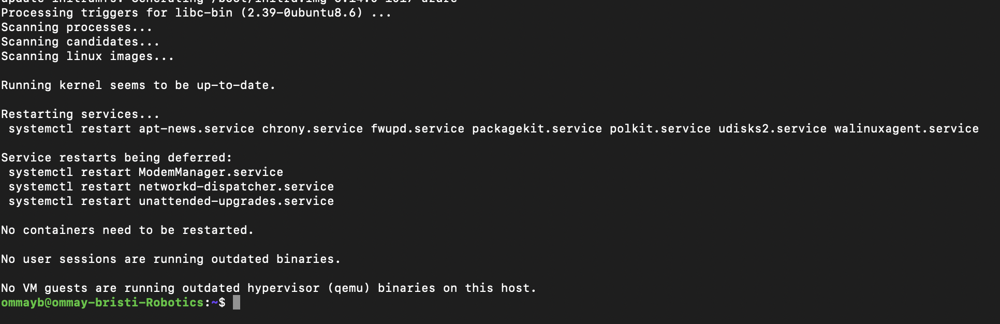

# Assignment 0 – Virtual Machine Creation (Azure)

## Student Information
- Name: Ommay Habiba Khatun Bristi
- Student Email: amk1006788@student.hamk.fi
- Date: 23.01.2026

---

## 1. Azure Account and Subscription

I created a Microsoft Azure account using my HAMK student email address.
After logging in to the Azure portal, I activated the **Azure for Students**
subscription to ensure free usage for course purposes.

---

## 2. Virtual Machine Creation

The virtual machine was created in Microsoft Azure with the following
configuration:

- **Virtual Machine Name**: ommay-bristi-Robotics
- **Operating System**: Ubuntu Server 24.04 LTS (Gen2)
- **Publisher**: Canonical
- **Region**: Switzerland North
- **VM Size**: Standard_B2s_v2 (2 vCPUs, 8 GiB RAM)
- **Architecture**: x64
- **Authentication Method**: SSH key
- **Resource Group**: Robotics-Students
- **Virtual Network/Subnet**: ommay-bristi-Robotics-vnet/default
- **Public IP Address**: 172.161.20.113
- **Allowed Inbound Port**: SSH (Port 22)

A new resource group and subnet were created specifically for this virtual
machine as required by the assignment.

---

## 3. SSH Connection Test

After the virtual machine was successfully deployed, I connected to the
machine using a terminal-based SSH client.

- **SSH Client**: Terminal (local machine)
- **Operating System (local)**: macOS
- **Destination Host (VM Public IP)**: 172.161.20.113
- **Port**: 22
⁠-⁠ *System Info*:
  - OS: Ubuntu 24.04.3 LTS
  - Kernel: GNU/Linux 6.14.0-1017-azure x86_64
  - IP Address: 10.0.0.4
  - Memory Usage: 4%
  - System Load: 0.07




*Update Command Executed*:

  ```bash
  sudo apt update && sudo apt upgrade -y
